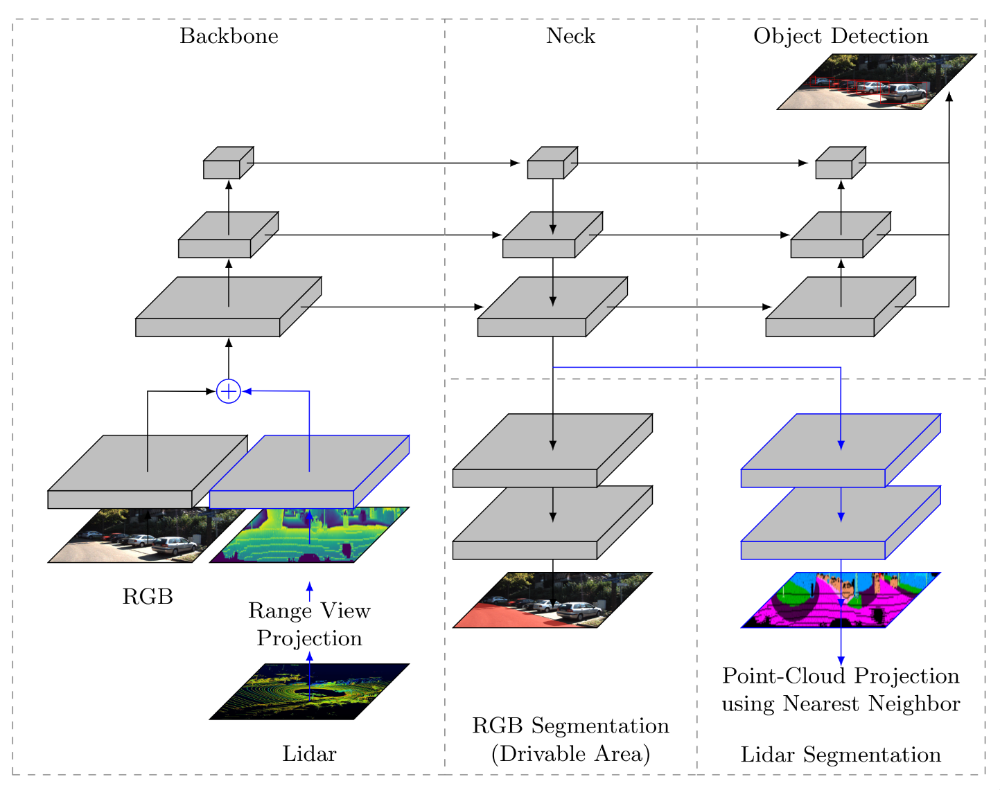

## You Only Look Once for Multimodal Multitasking

Note: This work builds upon [YOLOP](https://github.com/hustvl/YOLOP), please do check out that original repo.

### The Illustration of YOLOMM

The changes, compared to YOLOP, are highlighted in blue.
